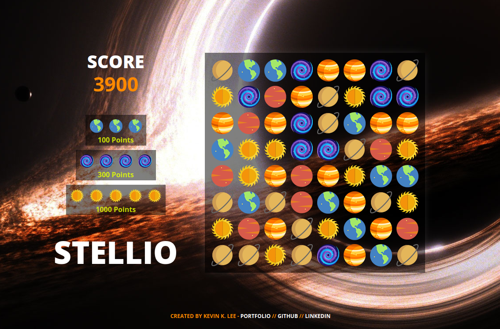

# Stellio



Stellio is a tile-matching game inspired by Bejeweled with the movie Interstellar theme.

> Stellio is currently **under development**. If you have any suggestions or comments, please e-mail me at kevin.kik.lee@gmail.com

## Implementation

- Javascript
- Create.js (Easel / Preload)

## Gameplay
- There are 6 different elements to match
  - Earth (Blue)
  - Mars (Red)
  - Saturn (Orange)
  - Venus (Yellow)
  - Mercury (White)
  - Black Hole (Black)

- A match of 3 planets award 100 points
- A match of 4 planets award 300 points
- A match of 5 planets award 1000 points

## Functionality

- [X] The game keeps the scoreboard
- [X] The tile tracks its element and position
- [X] The board populates with a random seed of tiles
- [X] A user can move a tile non-diagonally to match 3+ elements
- [ ] The user can start/restart the game

#### Development Tasks

- [ ] A tile of column falls to fill in the empty spaces
- [ ] Restrict diagonal mouse/tile movement

## Animation

```javascript
addFadeIn() {
  this.object.alpha = 0;
  createjs.Tween.get(this.object, { loop: false })
    .to({ alpha: 1 }, 500, createjs.Ease.getPowInOut(2));
}

addEnlarge() {
  createjs.Tween.get(this.object, { loop: false })
    .wait(1000)
    .to({ scaleX: 1.5, scaleY: 1.5}, 500, createjs.Ease.getPowInOut(2))
    .to({ scaleX: 1, scaleY: 1}, 500, createjs.Ease.getPowInOut(2))
}

addDelayedFadeIn() {
  this.object.alpha = 0;
  createjs.Tween.get(this.object, { loop: false })
    .wait(1000)
    .to({ alpha: 1 }, 1000, createjs.Ease.getPowInOut(2));
}
```

The animations use the PowInOut easing function.  Initial value change is steep in order to notify the user that the tile is in transition.  However, after the animation receives the attention of the user, the animation is significantly slowed down in order for the user to fully absorb which type of tiles have been affected.  Afterwards, the animation accelerates for the next animation to begin.  The following graph describes the PowInOut easing function where the x-axis represents time and y-axis represents the value.


