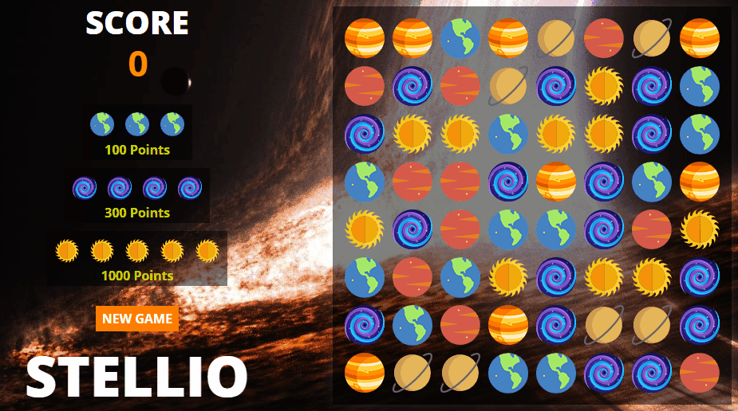
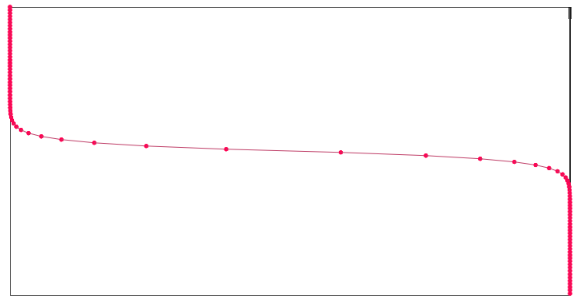

# Stellio



Stellio is a tile-matching game inspired by Bejeweled with the movie Interstellar theme.

> Stellio is currently **under development**. If you have any suggestions or comments, please e-mail me at kevin.kik.lee@gmail.com

## Implementation

- Javascript
- Create.js (Easel / Preload)

## Gameplay
- There are 6 different elements to match
  - Earth (Blue)
  - Mars (Red)
  - Saturn (Orange)
  - Venus (Yellow)
  - Mercury (White)
  - Black Hole (Black)

- A match of 3 planets award 100 points
- A match of 4 planets award 300 points
- A match of 5 planets award 1000 points

## Functionality

- [X] The game keeps the scoreboard
- [X] The tile tracks its element and position
- [X] The board populates with a random seed of tiles
- [X] A user can move a tile non-diagonally to match 3+ elements
- [X] The user can start/restart the game

#### Development Tasks

- [ ] A tile of column falls to fill in the empty spaces
- [ ] Restrict diagonal mouse/tile movement

## Mouse Movement

```javascript
moveTile(tile) {
  return event => {
    const OFFSET = 25;
    const DISTANCE = 60;

    const limitRowTop = tile.row_coord - DISTANCE + OFFSET;
    // Continues...

    const row = event.stageY;
    const col = event.stageX;

    if (row < limitRowBot && row > limitRowTop
     && col < limitColBot && col > limitColTop
     && row > 40 && row < 460
     && col > 40 && col < 460)
    {
      this.stage.setChildIndex(
        event.currentTarget, this.stage.getNumChildren() - 1
      );

      event.currentTarget.x = col - OFFSET;
      event.currentTarget.y = row - OFFSET;
    }
  }
}
```
Mouse movement is bounded by the coordinates of the board and within 60px of the originating position.  The offset of 25px (the tile radius) is accounted for because the mouse position is bound to the top-left corner of the grabbed object.

Eisel.js sets the order of the display index from the sequence of the objects added (i.e. the last added element is displayed on the top).  To account for this, the index of the grabbed element is brought to the top by invoking `setChildIndex`.

## Target Finder

```javascript
findSwapTgt(tile) {
  return event => {
    let tgt;
    const grid = this.grid;

    const row_diff = event.target.y - tile.row_coord;
    const col_diff = event.target.x - tile.col_coord;

    // LEFT
    if (row_diff > -20 && row_diff <  20
     && col_diff > -70 && col_diff < -20) {
      tgt = grid[tile.row][tile.col - 1];
    }

    // RIGHT
    if (row_diff > -20 && row_diff < 20
     && col_diff >  20 && col_diff < 70) {
      tgt = grid[tile.row][tile.col + 1];
    }

    // Continues ....
  }
}
```
When the user releases the mouse from the drag event, `findSwapTgt` callback function is invoked.  The difference is calculated from the current position of the mouse and the originating coordinate.  Through the conditionals, the target is assigned from the corresponding element found in the grid.

## Board Checking

```javascript
checkBoard(initial, afterMove) {
  const delay = initial ? 0 : 1400;

  setTimeout(
    () => {
      this.cleared = true;

      const transposedGrid = this.grid.map(
        (row, col) => this.grid.map(row => row[col])
      );

      this.grid.forEach(row => {
        this.checkSlice(row, initial, afterMove);
      });

      transposedGrid.forEach(col => {
        this.checkSlice(col, initial, afterMove);
      });

      if (!this.cleared)
        this.checkBoard(initial, afterMove);
    },
  delay, this);
}
```

After the initial tile matching, the board is recursively checked for more matches, along with a delay added for synchronized animation.  If the board check is triggered from the initial board population, the delay does not exist.

## Animation

```javascript
addMatchZoom(removeTiles) {
  createjs.Tween.get(this.object, { loop: false })
    .to({ scaleX: 1.2, scaleY: 1.2}, 300, createjs.Ease.getPowInOut(2))
    .to({ scaleX: 1, scaleY: 1}, 300, createjs.Ease.getPowInOut(2))
    .to({ alpha: 0 }, 300, createjs.Ease.getPowInOut(2))
    .call(() => (removeTiles([this])));
}

addDelayedFadeIn() {
  this.object.alpha = 0;
  createjs.Tween.get(this.object, { loop: false })
    .wait(900)
    .to({ alpha: 1 }, 400, createjs.Ease.getPowInOut(3));
}
```

The animations use the PowInOut easing function.  Initial value change is steep in order to notify the user that the tile is in transition.  However, after the animation receives the attention of the user, the animation is significantly slowed down in order for the user to fully absorb which type of tiles have been affected.  Afterwards, the animation accelerates for the next animation to begin.  The following graph describes the PowInOut easing function where the x-axis represents time and y-axis represents the value.


